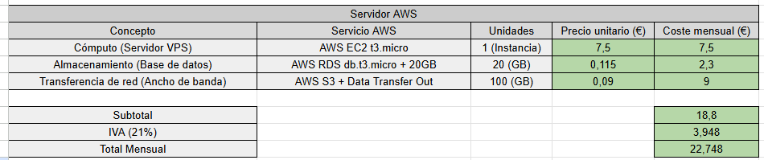

## 2. Estimación de Costes de Infraestructura

Se ha creado una hoja de cálculo con los costes mensuales estimados
para el alojamiento de la aplicación en AWS.
El cálculo incluye cómputo, almacenamiento y transferencia de red,
aplicando el IVA vigente del 21%.

El coste total mensual estimado sube hasta a **22,75 €**, lo que representa
una solución económicamente viable para la fase inicial del proyecto.

## 3. Estrategia de Despliegue y Comunicación

Para el despliegue de la aplicación en el servidor de producción se
utilizará **SFTP (SSH File Transfer Protocol)**, que opera sobre el
puerto 22 y cifra tanto las credenciales de acceso como los datos
en tránsito mediante el protocolo SSH. Esta elección descarta
deliberadamente el uso de FTP tradicional, ya que este transmite
usuario, contraseña y ficheros en texto plano, quedando expuesto
a ataques de tipo **man-in-the-middle.**

El flujo de despliegue sobre AWS será el siguiente:
1. El desarrollador conecta con la instancia EC2 mediante un cliente
   SFTP autenticado con clave SSH (puerto 22).
2. Se transfieren los ficheros actualizados al directorio de la
   aplicación en el servidor.
3. Se reinicia el servicio mediante SSH con el comando
   `systemctl restart [ServiorAWS]`.

Como alternativa complementaria, se valorará el uso de **AWS CodeDeploy**
para automatizar el proceso de despliegue desde el repositorio de GitHub,
eliminando la intervención manual y reduciendo el riesgo de errores humanos.

### 3.2 Mensajería y Alertas del Equipo

El equipo utilizará **Discord** como herramienta principal de comunicación
técnica, con canales diferenciados: `#incidencias`, `#despliegues` y
`#general`. Mediante **Webhooks de Discord**, el servidor AWS enviará
alertas automáticas al canal `#incidencias` cuando se detecte caída del
servicio o uso de CPU superior al 90%, permitiendo una respuesta inmediata
del equipo sin necesidad de revisar el servidor manualmente.

## 4. Justificación Científica

El uso de infraestructura cloud basada en AWS ha sido ampliamente
analizado en la literatura académica reciente. Según *Ahuja, S. P., Czarnecki, E., & Willison, S. (2020)*,
las instancias EC2 ofrecen una relación coste-rendimiento superior a los
servidores físicos tradicionales en entornos de desarrollo web, destacando
especialmente su capacidad de escalado automático ante picos de demanda.
Estos resultados respaldan la decisión de nuestro proyecto de utilizar
AWS EC2 como base de la infraestructura de producción, garantizando
disponibilidad y control de costes desde las fases iniciales.

## Referencias

[1] Ahuja, S. P., Czarnecki, E., & Willison, S. (2020). Multi-factor performance comparison of amazon web services elastic compute cluster and google cloud platform compute engine. International Journal of Cloud Applications and Computing (IJCAC), 10(3), 1-16.

